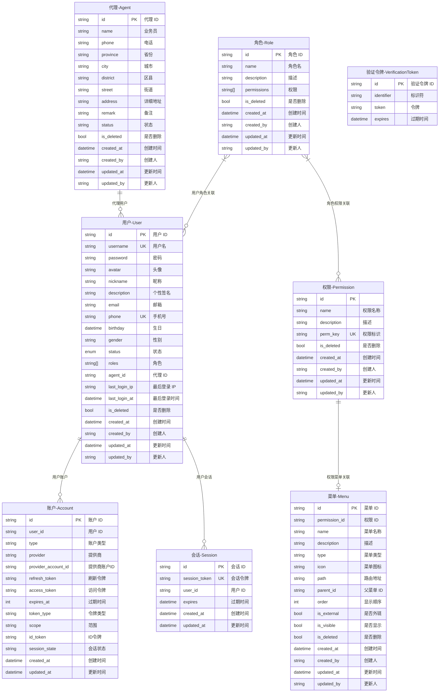
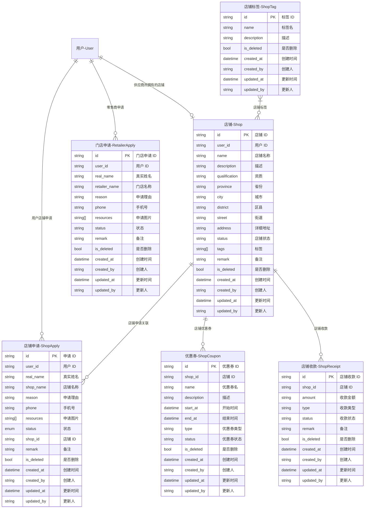
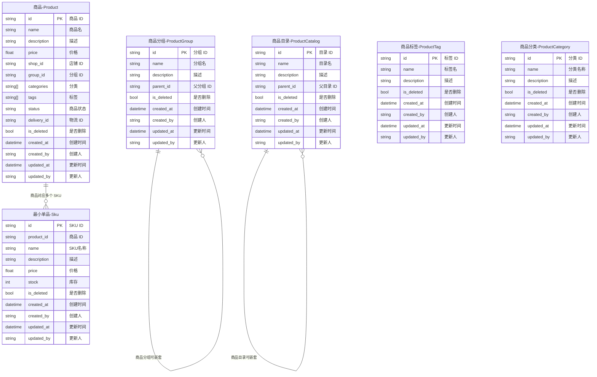
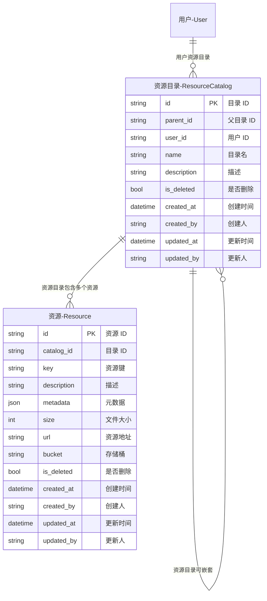
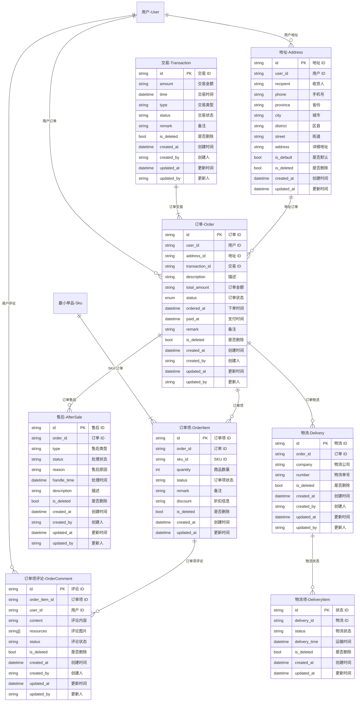
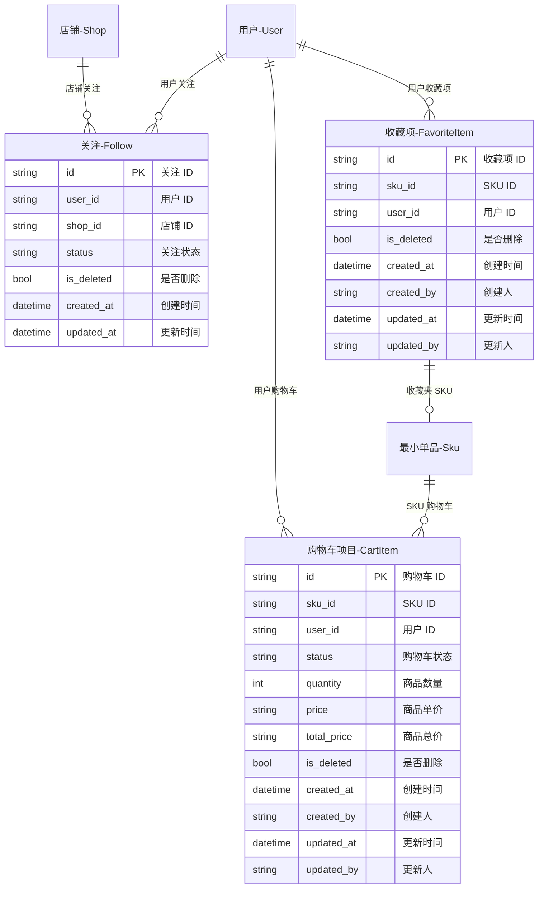
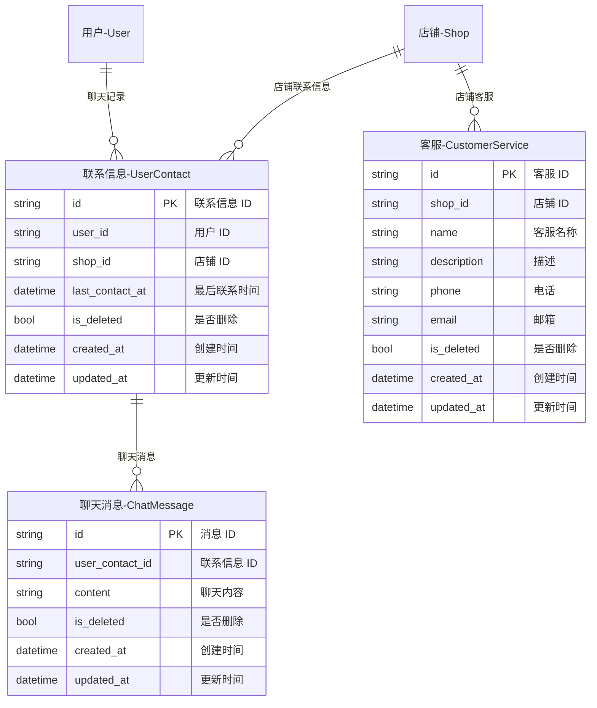
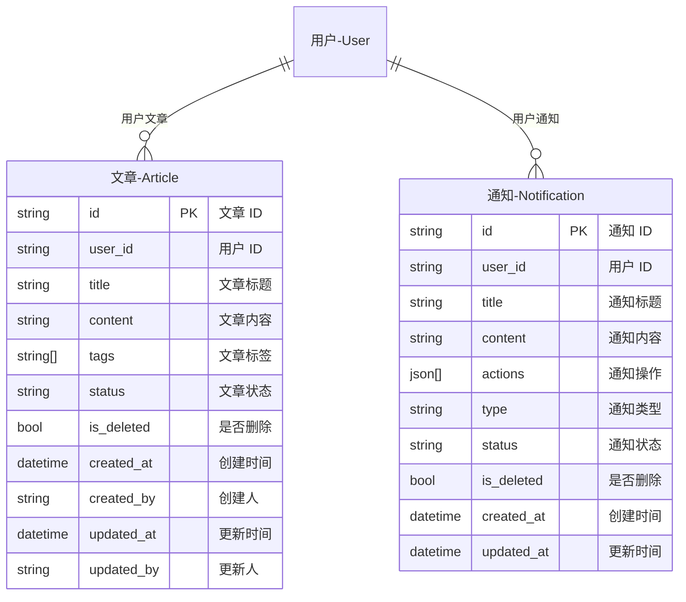
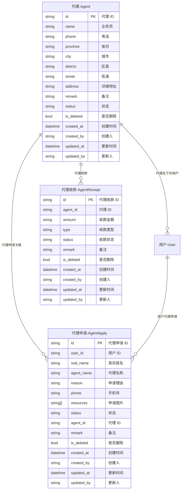
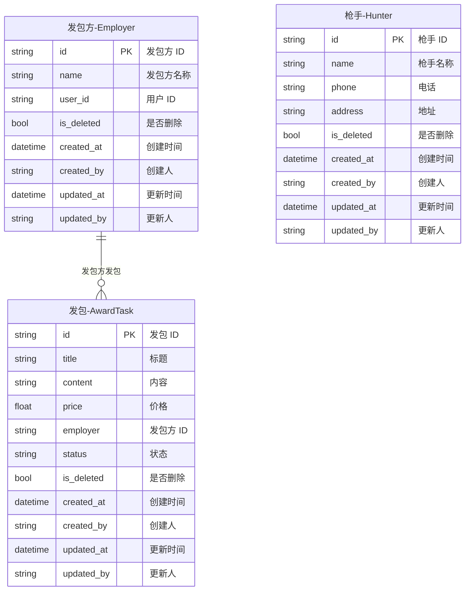

# 实体模型设计

## 用户权限系统

```mermaid
erDiagram
  Role }|--o{ User : "用户角色关联"
  Role }|--o{ Permission : "角色权限关联"
  Permission ||--o| Menu : "权限菜单关联"
  Agent ||--o{ User : "代理用户"
  User ||--o{ Account : "用户账户"
  User ||--o{ Session : "用户会话"

  Agent["代理-Agent"] {
    string id PK "代理 ID"
    string name "业务员"
    string phone "电话"
    string province "省份"
    string city "城市"
    string district "区县"
    string street "街道"
    string address "详细地址"
    string remark "备注"
    string status "状态"
    bool is_deleted "是否删除"
    datetime created_at "创建时间"
    string created_by "创建人"
    datetime updated_at "更新时间"
    string updated_by "更新人"
  }

  User["用户-User"] {
    string id PK "用户 ID"
    string username UK "用户名"
    string password "密码"
    string avatar "头像"
    string nickname "昵称"
    string description "个性签名"
    string email "邮箱"
    string phone UK "手机号"
    datetime birthday "生日"
    string gender "性别"
    enum status "状态"
    string[] roles "角色"
    string agent_id "代理 ID"
    string last_login_ip "最后登录 IP"
    datetime last_login_at "最后登录时间"
    bool is_deleted "是否删除"
    datetime created_at "创建时间"
    string created_by "创建人"
    datetime updated_at "更新时间"
    string updated_by "更新人"
  }

  Role["角色-Role"] {
    string id PK "角色 ID"
    string name "角色名"
    string description "描述"
    string[] permissions "权限"
    bool is_deleted "是否删除"
    datetime created_at "创建时间"
    string created_by "创建人"
    datetime updated_at "更新时间"
    string updated_by "更新人"
  }

  Permission["权限-Permission"] {
    string id PK
    string name "权限名称"
    string description "描述"
    string perm_key UK "权限标识"
    bool is_deleted "是否删除"
    datetime created_at "创建时间"
    string created_by "创建人"
    datetime updated_at "更新时间"
    string updated_by "更新人"
  }

  Menu["菜单-Menu"] {
    string id PK "菜单 ID"
    string permission_id "权限 ID"
    string name "菜单名称"
    string description "描述"
    string type "菜单类型"
    string icon "菜单图标"
    string path "路由地址"
    string parent_id "父菜单 ID"
    int order "显示顺序"
    bool is_external "是否外链"
    bool is_visible "是否显示"
    bool is_deleted "是否删除"
    datetime created_at "创建时间"
    string created_by "创建人"
    datetime updated_at "更新时间"
    string updated_by "更新人"
  }

  Account["账户-Account"] {
    string id PK "账户 ID"
    string user_id "用户 ID"
    string type "账户类型"
    string provider "提供商"
    string provider_account_id "提供商账户ID"
    string refresh_token "刷新令牌"
    string access_token "访问令牌"
    int expires_at "过期时间"
    string token_type "令牌类型"
    string scope "范围"
    string id_token "ID令牌"
    string session_state "会话状态"
    datetime created_at "创建时间"
    datetime updated_at "更新时间"
  }

  Session["会话-Session"] {
    string id PK "会话 ID"
    string session_token UK "会话令牌"
    string user_id "用户 ID"
    datetime expires "过期时间"
    datetime created_at "创建时间"
    datetime updated_at "更新时间"
  }

  VerificationToken["验证令牌-VerificationToken"] {
    string id PK "验证令牌 ID"
    string identifier "标识符"
    string token "令牌"
    datetime expires "过期时间"
  }
```

## 商城系统：店铺

```mermaid
erDiagram
  User ||--o| Shop : "供应商所拥有的店铺"
  User ||--o{ ShopApply : "用户店铺申请"
  Shop ||--o{ ShopApply : "店铺申请关联"
  ShopTag }|--o{ Shop : "店铺标签"
  Shop ||--o{ ShopCoupon : "店铺优惠券"
  User ||--o{ RetailerApply : "零售商申请"
  Shop ||--o{ ShopReceipt : "店铺收款"

  User["用户-User"] {}

  ShopTag["店铺标签-ShopTag"] {
    string id PK "标签 ID"
    string name "标签名"
    string description "描述"
    bool is_deleted "是否删除"
    datetime created_at "创建时间"
    string created_by "创建人"
    datetime updated_at "更新时间"
    string updated_by "更新人"
  }

  Shop["店铺-Shop"] {
    string id PK "店铺 ID"
    string user_id "用户 ID"
    string name "店铺名称"
    string description "描述"
    string qualification "资质"
    string province "省份"
    string city "城市"
    string district "区县"
    string street "街道"
    string address "详细地址"
    string status "店铺状态"
    string[] tags "标签"
    string remark "备注"
    bool is_deleted "是否删除"
    datetime created_at "创建时间"
    string created_by "创建人"
    datetime updated_at "更新时间"
    string updated_by "更新人"
  }

  ShopCoupon["优惠券-ShopCoupon"] {
    string id PK "优惠券 ID"
    string shop_id "店铺 ID"
    string name "优惠券名"
    string description "描述"
    datetime start_at "开始时间"
    datetime end_at "结束时间"
    string type "优惠券类型"
    string status "优惠券状态"
    bool is_deleted "是否删除"
    datetime created_at "创建时间"
    string created_by "创建人"
    datetime updated_at "更新时间"
    string updated_by "更新人"
  }

  ShopApply["店铺申请-ShopApply"] {
    string id PK "申请 ID"
    string user_id "用户 ID"
    string real_name "真实姓名"
    string shop_name "店铺名称"
    string reason "申请理由"
    string phone "手机号"
    string[] resources "申请图片"
    enum status "状态"
    string shop_id "店铺 ID"
    string remark "备注"
    bool is_deleted "是否删除"
    datetime created_at "创建时间"
    string created_by "创建人"
    datetime updated_at "更新时间"
    string updated_by "更新人"
  }

  RetailerApply["门店申请-RetailerApply"] {
    string id PK "门店申请 ID"
    string user_id "用户 ID"
    string real_name "真实姓名"
    string retailer_name "门店名称"
    string reason "申请理由"
    string phone "手机号"
    string[] resources "申请图片"
    string status "状态"
    string remark "备注"
    bool is_deleted "是否删除"
    datetime created_at "创建时间"
    string created_by "创建人"
    datetime updated_at "更新时间"
    string updated_by "更新人"
  }

  ShopReceipt["店铺收款-ShopReceipt"] {
    string id PK "店铺收款 ID"
    string shop_id "店铺 ID"
    string amount "收款金额"
    string type "收款类型"
    string status "收款状态"
    string remark "备注"
    bool is_deleted "是否删除"
    datetime created_at "创建时间"
    string created_by "创建人"
    datetime updated_at "更新时间"
    string updated_by "更新人"
  }
```

## 商城系统：商品

```mermaid
erDiagram
  Product ||--o{ Sku : "商品对应多个 SKU"
  ProductGroup ||--o{ ProductGroup : "商品分组可嵌套"
  ProductCatalog ||--o{ ProductCatalog : "商品目录可嵌套"

  Product["商品-Product"] {
    string id PK "商品 ID"
    string name "商品名"
    string description "描述"
    float price "价格"
    string shop_id "店铺 ID"
    string group_id "分组 ID"
    string[] categories "分类"
    string[] tags "标签"
    string status "商品状态"
    string delivery_id "物流 ID"
    bool is_deleted "是否删除"
    datetime created_at "创建时间"
    string created_by "创建人"
    datetime updated_at "更新时间"
    string updated_by "更新人"
  }

  ProductTag["商品标签-ProductTag"] {
    string id PK "标签 ID"
    string name "标签名"
    string description "描述"
    bool is_deleted "是否删除"
    datetime created_at "创建时间"
    string created_by "创建人"
    datetime updated_at "更新时间"
    string updated_by "更新人"
  }

  ProductGroup["商品分组-ProductGroup"] {
    string id PK "分组 ID"
    string name "分组名"
    string description "描述"
    string parent_id "父分组 ID"
    bool is_deleted "是否删除"
    datetime created_at "创建时间"
    string created_by "创建人"
    datetime updated_at "更新时间"
    string updated_by "更新人"
  }

  Sku["最小单品-Sku"] {
    string id PK "SKU ID"
    string product_id "商品 ID"
    string name "SKU名称"
    string description "描述"
    float price "价格"
    int stock "库存"
    bool is_deleted "是否删除"
    datetime created_at "创建时间"
    string created_by "创建人"
    datetime updated_at "更新时间"
    string updated_by "更新人"
  }

  ProductCategory["商品分类-ProductCategory"] {
    string id PK "分类 ID"
    string name "分类名称"
    string description "描述"
    bool is_deleted "是否删除"
    datetime created_at "创建时间"
    string created_by "创建人"
    datetime updated_at "更新时间"
    string updated_by "更新人"
  }

  ProductCatalog["商品目录-ProductCatalog"]{
    string id PK "目录 ID"
    string name "目录名"
    string description "描述"
    string parent_id "父目录 ID"
    bool is_deleted "是否删除"
    datetime created_at "创建时间"
    string created_by "创建人"
    datetime updated_at "更新时间"
    string updated_by "更新人"
  }
```

## 商城系统：资源

```mermaid
erDiagram
  ResourceCatalog ||--o{ Resource : "资源目录包含多个资源"
  ResourceCatalog ||--o{ ResourceCatalog : "资源目录可嵌套"
  User ||--o{ ResourceCatalog : "用户资源目录"

  User["用户-User"] {}

  Resource["资源-Resource"] {
    string id PK "资源 ID"
    string catalog_id "目录 ID"
    string key "资源键"
    string description "描述"
    json metadata "元数据"
    int size "文件大小"
    string url "资源地址"
    string bucket "存储桶"
    bool is_deleted "是否删除"
    datetime created_at "创建时间"
    string created_by "创建人"
    datetime updated_at "更新时间"
    string updated_by "更新人"
  }

  ResourceCatalog["资源目录-ResourceCatalog"] {
    string id PK "目录 ID"
    string parent_id "父目录 ID"
    string user_id "用户 ID"
    string name "目录名"
    string description "描述"
    bool is_deleted "是否删除"
    datetime created_at "创建时间"
    string created_by "创建人"
    datetime updated_at "更新时间"
    string updated_by "更新人"
  }
```

## 商城系统：订单

```mermaid
erDiagram
  User ||--o{ Address: "用户地址"
  User ||--o{ Order: "用户订单"
  Sku ||--|{ OrderItem: "SKU 订单"
  Order ||--o{ AfterSale: "订单售后"
  Transaction ||--|{ Order : "订单交易"
  Order ||--o{ OrderItem: "订单项"
  User ||--o{ OrderComment: "用户评论"
  OrderItem ||--o{ OrderComment: "订单项评论"
  Delivery ||--o{ DeliveryItem: "物流状态"
  Order ||--o{ Delivery: "订单物流"
  Address ||--o{ Order: "地址订单"

  User["用户-User"] {}

  Sku["最小单品-Sku"] {}

  Address["地址-Address"] {
    string id PK "地址 ID"
    string user_id "用户 ID"
    string recipient "收货人"
    string phone "手机号"
    string province "省份"
    string city "城市"
    string district "区县"
    string street "街道"
    string address "详细地址"
    bool is_default "是否默认"
    bool is_deleted "是否删除"
    datetime created_at "创建时间"
    datetime updated_at "更新时间"
  }

  Order["订单-Order"] {
    string id PK "订单 ID"
    string user_id "用户 ID"
    string address_id "地址 ID"
    string transaction_id "交易 ID"
    string description "描述"
    string total_amount "订单金额"
    enum status "订单状态"
    datetime ordered_at "下单时间"
    datetime paid_at "支付时间"
    string remark "备注"
    bool is_deleted "是否删除"
    datetime created_at "创建时间"
    string created_by "创建人"
    datetime updated_at "更新时间"
    string updated_by "更新人"
  }

  OrderItem["订单项-OrderItem"] {
    string id PK "订单项 ID"
    string order_id "订单 ID"
    string sku_id "SKU ID"
    int quantity "商品数量"
    string status "订单项状态"
    string remark "备注"
    string discount "折扣信息"
    bool is_deleted "是否删除"
    datetime created_at "创建时间"
    datetime updated_at "更新时间"
  }

  AfterSale["售后-AfterSale"] {
    string id PK "售后 ID"
    string order_id "订单 ID"
    string type "售后类型"
    string status "处理状态"
    string reason "售后原因"
    datetime handle_time "处理时间"
    string description "描述"
    bool is_deleted "是否删除"
    datetime created_at "创建时间"
    string created_by "创建人"
    datetime updated_at "更新时间"
    string updated_by "更新人"
  }

  Transaction["交易-Transaction"] {
    string id PK "交易 ID"
    string amount "交易金额"
    datetime time "交易时间"
    string type "交易类型"
    string status "交易状态"
    string remark "备注"
    bool is_deleted "是否删除"
    datetime created_at "创建时间"
    string created_by "创建人"
    datetime updated_at "更新时间"
    string updated_by "更新人"
  }

  OrderComment["订单项评论-OrderComment"] {
    string id PK "评论 ID"
    string order_item_id "订单项 ID"
    string user_id "用户 ID"
    string content "评论内容"
    string[] resources "评论图片"
    string status "评论状态"
    bool is_deleted "是否删除"
    datetime created_at "创建时间"
    string created_by "创建人"
    datetime updated_at "更新时间"
    string updated_by "更新人"
  }

  Delivery["物流-Delivery"] {
    string id PK "物流 ID"
    string order_id "订单 ID"
    string company "物流公司"
    string number "物流单号"
    bool is_deleted "是否删除"
    datetime created_at "创建时间"
    string created_by "创建人"
    datetime updated_at "更新时间"
    string updated_by "更新人"
  }

  DeliveryItem["物流项-DeliveryItem"] {
    string id PK "状态 ID"
    string delivery_id "物流 ID"
    string status "物流状态"
    datetime delivery_time "运输时间"
    bool is_deleted "是否删除"
    datetime created_at "创建时间"
    datetime updated_at "更新时间"
  }
```

## 商城系统：关注收藏

```mermaid
erDiagram
  User ||--o{ CartItem: "用户购物车"
  Shop ||--o{ Follow: "店铺关注"
  User ||--o{ Follow: "用户关注"
  Sku ||--o{ CartItem: "SKU 购物车"
  User ||--o{ FavoriteItem: "用户收藏项"
  FavoriteItem ||--o| Sku: "收藏夹 SKU"

  User["用户-User"] {}

  Sku["最小单品-Sku"] {}

  Shop["店铺-Shop"] {}

  Follow["关注-Follow"] {
    string id PK "关注 ID"
    string user_id "用户 ID"
    string shop_id "店铺 ID"
    string status "关注状态"
    bool is_deleted "是否删除"
    datetime created_at "创建时间"
    datetime updated_at "更新时间"
  }

  CartItem["购物车项目-CartItem"] {
    string id PK "购物车 ID"
    string sku_id "SKU ID"
    string user_id "用户 ID"
    string status "购物车状态"
    int quantity "商品数量"
    string price "商品单价"
    string total_price "商品总价"
    bool is_deleted "是否删除"
    datetime created_at "创建时间"
    string created_by "创建人"
    datetime updated_at "更新时间"
    string updated_by "更新人"
  }

  FavoriteItem["收藏项-FavoriteItem"] {
    string id PK "收藏项 ID"
    string sku_id "SKU ID"
    string user_id "用户 ID"
    bool is_deleted "是否删除"
    datetime created_at "创建时间"
    string created_by "创建人"
    datetime updated_at "更新时间"
    string updated_by "更新人"
  }
```

## 商城系统：客服系统

```mermaid
erDiagram
  User ||--o{ UserContact: "聊天记录"
  Shop ||--o{ CustomerService: "店铺客服"
  Shop ||--o{ UserContact: "店铺联系信息"
  UserContact ||--o{ ChatMessage: "聊天消息"

  User["用户-User"] {}

  Shop["店铺-Shop"] {}

  UserContact["联系信息-UserContact"] {
    string id PK "联系信息 ID"
    string user_id "用户 ID"
    string shop_id "店铺 ID"
    datetime last_contact_at "最后联系时间"
    bool is_deleted "是否删除"
    datetime created_at "创建时间"
    datetime updated_at "更新时间"
  }

  CustomerService["客服-CustomerService"] {
    string id PK "客服 ID"
    string shop_id "店铺 ID"
    string name "客服名称"
    string description "描述"
    string phone "电话"
    string email "邮箱"
    bool is_deleted "是否删除"
    datetime created_at "创建时间"
    datetime updated_at "更新时间"
  }

  ChatMessage["聊天消息-ChatMessage"] {
    string id PK "消息 ID"
    string user_contact_id "联系信息 ID"
    string content "聊天内容"
    bool is_deleted "是否删除"
    datetime created_at "创建时间"
    datetime updated_at "更新时间"
  }
```

## 商城系统：资讯和推送

```mermaid
erDiagram
  User ||--o{ Article: "用户文章"
  User ||--o{ Notification: "用户通知"

  User["用户-User"] {}

  Article["文章-Article"] {
    string id PK "文章 ID"
    string user_id "用户 ID"
    string title "文章标题"
    string content "文章内容"
    string[] tags "文章标签"
    string status "文章状态"
    bool is_deleted "是否删除"
    datetime created_at "创建时间"
    string created_by "创建人"
    datetime updated_at "更新时间"
    string updated_by "更新人"
  }

  Notification["通知-Notification"] {
    string id PK "通知 ID"
    string user_id "用户 ID"
    string title "通知标题"
    string content "通知内容"
    json[] actions "通知操作"
    string type "通知类型"
    string status "通知状态"
    bool is_deleted "是否删除"
    datetime created_at "创建时间"
    datetime updated_at "更新时间"
  }
```

## 代理系统

```mermaid
erDiagram
  Agent ||--o{ User: "代理名下的用户"
  Agent ||--o{ AgentReceipt: "代理收款"
  Agent ||--o{ AgentApply: "代理申请关联"
  User ||--o{ AgentApply: "用户代理申请"

  User["用户-User"] {}

  Agent["代理-Agent"] {
    string id PK "代理 ID"
    string name "业务员"
    string phone "电话"
    string province "省份"
    string city "城市"
    string district "区县"
    string street "街道"
    string address "详细地址"
    string remark "备注"
    string status "状态"
    bool is_deleted "是否删除"
    datetime created_at "创建时间"
    string created_by "创建人"
    datetime updated_at "更新时间"
    string updated_by "更新人"
  }

  AgentReceipt["代理收款-AgentReceipt"] {
    string id PK "代理收款 ID"
    string agent_id "代理 ID"
    string amount "收款金额"
    string type "收款类型"
    string status "收款状态"
    string remark "备注"
    bool is_deleted "是否删除"
    datetime created_at "创建时间"
    string created_by "创建人"
    datetime updated_at "更新时间"
    string updated_by "更新人"
  }

  AgentApply["代理申请-AgentApply"] {
    string id PK "代理申请 ID"
    string user_id "用户 ID"
    string real_name "真实姓名"
    string agent_name "代理名称"
    string reason "申请理由"
    string phone "手机号"
    string[] resources "申请图片"
    string status "状态"
    string agent_id "代理 ID"
    string remark "备注"
    bool is_deleted "是否删除"
    datetime created_at "创建时间"
    string created_by "创建人"
    datetime updated_at "更新时间"
    string updated_by "更新人"
  }
```

## 发包系统

```mermaid
erDiagram
  Employer ||--o{ AwardTask: "发包方发包"

  Employer["发包方-Employer"] {
    string id PK "发包方 ID"
    string name "发包方名称"
    string user_id "用户 ID"
    bool is_deleted "是否删除"
    datetime created_at "创建时间"
    string created_by "创建人"
    datetime updated_at "更新时间"
    string updated_by "更新人"
  }

  Hunter["枪手-Hunter"] {
    string id PK "枪手 ID"
    string name "枪手名称"
    string phone "电话"
    string address "地址"
    bool is_deleted "是否删除"
    datetime created_at "创建时间"
    string created_by "创建人"
    datetime updated_at "更新时间"
    string updated_by "更新人"
  }

  AwardTask["发包-AwardTask"] {
    string id PK "发包 ID"
    string title "标题"
    string content "内容"
    float price "价格"
    string employer "发包方 ID"
    string status "状态"
    bool is_deleted "是否删除"
    datetime created_at "创建时间"
    string created_by "创建人"
    datetime updated_at "更新时间"
    string updated_by "更新人"
  }
```
