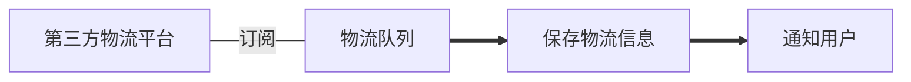
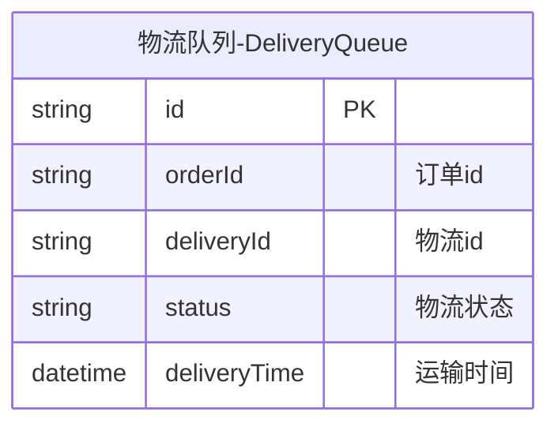
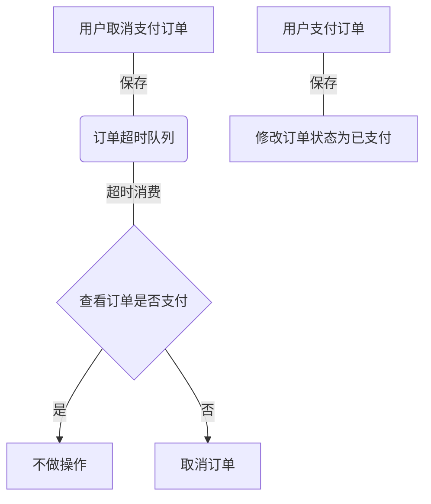
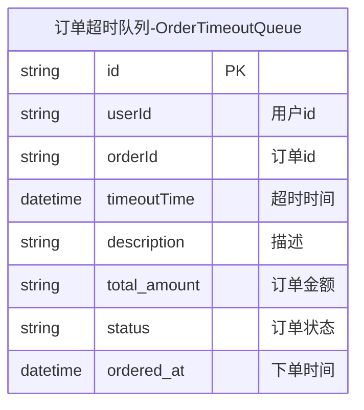
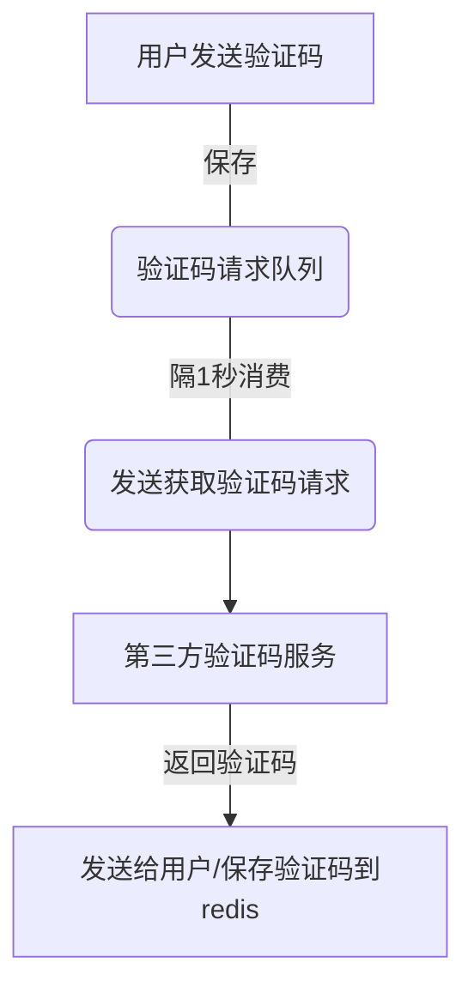
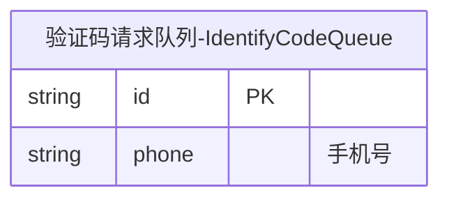

# MQ模型设计

## 物流推送

```mermaid
flowchart LR

  第三方物流平台  ---|"订阅" | 物流队列
  物流队列  ==> 保存物流信息
  保存物流信息  ==> 通知用户
```

```mermaid
erDiagram
  DeliveryQueue["物流队列-DeliveryQueue"] {
    string id PK
    string orderId "订单id"
    string deliveryId "物流id"
    string status "物流状态"
    datetime deliveryTime "运输时间"
  }
```

## 订单超时

```mermaid
graph TD
  A[用户取消支付订单] ---|"保存" | B(订单超时队列)
  B ---|"超时消费"| C{ 查看订单是否支付 }
  C --> |是| D[不做操作]
  C --> |否| E[取消订单]
  F[用户支付订单] ---|"保存" | G[修改订单状态为已支付]

%% 这里应该在延迟队列一直消费 不然用户在有限时间内支付了订单 不消费还在倒计时
```

```mermaid
erDiagram
  OrderTimeoutQueue["订单超时队列-OrderTimeoutQueue"] {
    string id PK
    string userId "用户id"
    string orderId "订单id"
    datetime timeoutTime "超时时间"
    string description "描述"
    string total_amount "订单金额"
    string status "订单状态"
    datetime ordered_at "下单时间"
  }
```

## 手机号登录

```mermaid
graph TD
  A[用户发送验证码] ---|"保存" | B(验证码请求队列)
  B ---|"隔1秒消费"| C(发送获取验证码请求 )
  C --> D[第三方验证码服务]
  D --> |返回验证码| E[发送给用户/保存验证码到redis]
```

```mermaid
erDiagram
  IdentifyCodeQueue["验证码请求队列-IdentifyCodeQueue"] {
    string id PK
    string phone "手机号"
  }
```
