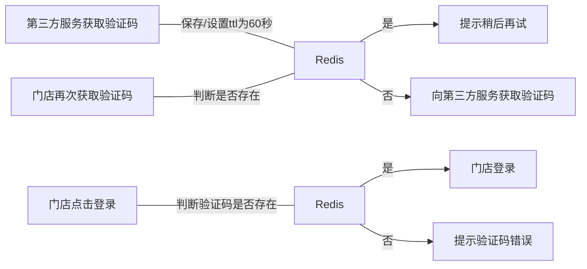
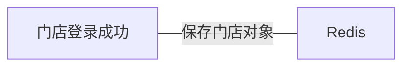

# Redis模型设计

## 短信验证码

```mermaid
flowchart LR
  第三方服务获取验证码  ---|"保存/设置ttl为60秒" | Redis
  门店再次获取验证码  ---|"判断是否存在" | Redis
  Redis --> |是| 提示稍后再试
  Redis --> |否| 向第三方服务获取验证码

  门店点击登录  ---|"判断验证码是否存在" | A[Redis]
  A --> |是| 门店登录
  A --> |否| 提示验证码错误
```

## 门店会话信息 / 门店登录信息

```mermaid
flowchart LR

门店登录成功  ---|"保存门店对象" | Redis
```
